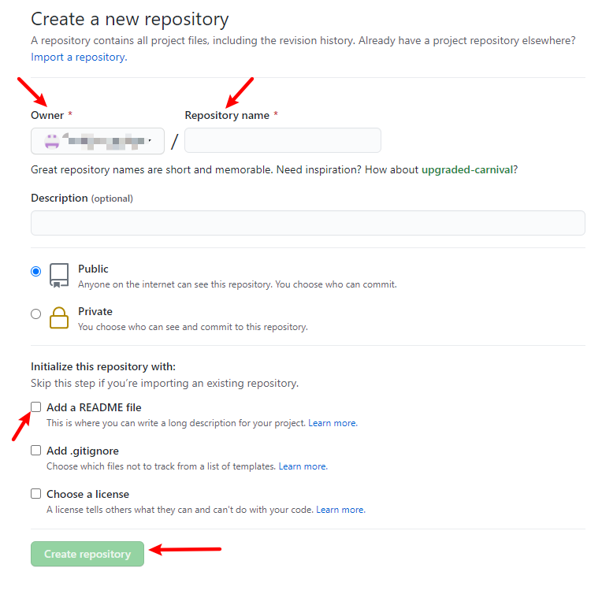

# 基于Hugo + Github Pages + Netlify搭建LoveIt主题个人博客


这篇文章介绍了如何使用Hugo与Github Pages搭建个人博客，同时部署在Netlify上。

<!--more-->

很早就想搭建一个个人博客用来记录自己的所学所得。趁着假期有时间，读了几十篇教程和文档，终于搭建了自己喜欢的博客。鉴于网上很多教程部分过旧，部分对于新手不够友好。在此记录下我搭建这个博客的过程，纯小白向，毫无压力就可以拥有自己的博客。


#### Step 1 注册Github账户并创建仓库

登录[Github](https://github.com/)网站，点击右上角的`Sign Up`进行注册


填上用户名，邮箱地址，密码等相关信息后，点击`Create account`即可


登录后，点击`Repositories`新建一个仓库，`Repository name`需要与`Owner`一致，这样Blog的网址就不会多一个层级。需要注意的是仓库的名字必须以github.io结尾，这样Github才能解析该域名。最后仓库的名字格式为`Owner name(你自己的用户名).github.io`。勾选新建README文件，最后点击创建仓库`Create Repository`即可。




至此，创建好了用以保存发布博客的仓库后，我们可以开始使用Hugo创建Blog


#### Step2 安装Hugo

Hugo的安装也很简单，只需要去[Hugo官网](https://github.com/gohugoio/hugo/releases)下载适合你电脑的安装包，直接解压到你想安装的路径，最后将该路径添加到PATH环境变量即可。建议一步到位，直接安装`hugo_extended`版本，因为LoveIt主题中有一些Features的实现只有extended版本的Hugo支持。我使用的是Win10系统64bit版本，因此选择[hugo_extended_0.79.1_Windows-64bit.zip](https://github.com/gohugoio/hugo/releases/download/v0.79.1/hugo_extended_0.79.1_Windows-64bit.zip)即可。其它系统的安装详见[Hugo官网介绍](https://gohugo.io/getting-started/installing/)，文档都很详细。

关于如何更改Win10系统的PATH，详见以下步骤：

双击`计算机`图标，点击菜单栏的计算机，点击系统属性


左侧导航栏最下，点击`关于(About)`，在`相关设置(Related settings)`中选择`系统信息(System info)`


弹出`系统(System)`页面，点击左侧导航栏中的`高级系统设置`


弹出`系统属性(System properties)`界面，点击`环境变量(Environment Variables)`打开环境变量设置界面


选择`系统变量(System variables)`中的PATH，点击编辑


点击`新建(New)`，将Hugo解压的地址添加到环境变量，点击OK即可


如果想要查看Hugo是否添加到了环境变量中，可以打开cmd窗口，输入path即可查看当前环境变量中所有已添加路径的信息。至此，Hugo的安装已经完成


#### Step 4 安装git

我们需要通过git把本地Hugo建立的文件上传到Github的仓库中，因此需要下载[git](https://git-scm.com/download/win)，点击链接进入后，选一个符合电脑的git安装包，下载安装即可


#### Step 5 使用Hugo创建站点

关于Hugo创建Blog的教程非常多，Hugo的文档写的也非常详细，如果想深入了解的话，可以自行阅读[官方文档](https://gohugo.io/getting-started/quick-start/)
建立新站点的步骤非常简单，首先新建一个文件夹`blog_demo`，进入该文件夹后，右击空白区域，点击`Git Bash Here`打开一个终端命令窗口，输入以下命令

```bash
hugo new site myblog
```

运行成功后，会有以下提示表明站点创建成功

```bash
$ hugo new site myblog
Congratulations! Your new Hugo site is created in D:\demo\blog_demo\myblog.

Just a few more steps and you're ready to go:

1. Download a theme into the same-named folder.
   Choose a theme from https://themes.gohugo.io/ or
   create your own with the "hugo new theme <THEMENAME>" command.
2. Perhaps you want to add some content. You can add single files
   with "hugo new <SECTIONNAME>\<FILENAME>.<FORMAT>".
3. Start the built-in live server via "hugo server".

Visit https://gohugo.io/ for quickstart guide and full documentation.
```

进入创建好的站点目录内

```bash
cd myblog
```

`myblog`中的目录结构如下：

├──archetypes # 内容类型，在创建新内容时自动生成内容的配置，其中可以保存文章模板信息
├── content # 网站内容，Markdown 文件
├── data
├── layouts # 网站模版，选择主题后会将主题中的 `layouts` 文件夹中的内容复制到此文件夹中
├── static # 包含 CSS、JavaScript、Fonts、media 等，决定网站的外观。选择主题后会将主题中的 `ststic` 文件夹中的内容复制到此文件夹中
├── themes # 存放主题文件
└── config.toml # 网站的配置文件

创建完站点后，下载主题。Hugo提供了上百个主题供用户选择，我选择了LoveIt，拓展功能比较全面，我也比较喜欢整体的风格。如果想要了解更多主题的信息，可以点击此链接：[Hugo Themes](https://themes.gohugo.io/)

下面下载LoveIt主题

```bash
git init
git submodule add https://github.com/dillonzq/LoveIt.git themes/LoveIt
```

为了可以成功的使用该主题，需要进行以下修改

首先进入`myblog\themes\LoveIt\exampleSite`目录下，复制`config.toml`文件，将其粘贴至`myblog`下以替换原有的`config.toml`文件，使用notepad++或者其他文本编辑器打开`myblog`目录下的`config.toml`文件，修改`baseURL`，`themeDir`以及`enableGitinfo`三行内容如下：

```bash
baseURL = "https://example.com"   ## 修改为你的github.io地址，格式为：https://yourusername.github.io
# [en, zh-cn, fr, pl, ...] determines default content language
# [en, zh-cn, fr, pl, ...] 设置默认的语言
defaultContentLanguage = "en"
# theme
# 主题
theme = "LoveIt"
# themes directory
# 主题目录
#themesDir = "../.." ## 注释掉该行

# website title
# 网站标题
title = "LoveIt"

# whether to use robots.txt
# 是否使用 robots.txt
enableRobotsTXT = true
# whether to use git commit log
# 是否使用 git 信息
enableGitInfo = false ## 由true改为false
# whether to use emoji code
# 是否使用 emoji 代码
enableEmoji = true
```

修改保存后，在git bash中运行以下代码：

```bash
hugo serve
```

这时Hugo会配置好整个站点，你可以在浏览器打开`http://localhost:1313/`访问你的博客了。

如果你想设置自己喜欢的头像，可以使用[Favicon Generator](https://realfavicongenerator.net/)，点击进入该网站，点击`Select your Favicon image`上传你的图片

页面会转换到一个新的界面，可以选择裁剪你上传的图片，然后点击`Continue with this picture`

转到新的页面，拉至最下方，点击`Generate your Favicons and HTML code`，最后点击`Favicon package`下载压缩包，将压缩包解压至`myblog\static`中，将作为头像的图片重命名为`avatar.png`即可


#### Step 6 修改config.toml文件

LoveIt的配置文件中包含大量信息，该主题的作者对每个部分进行了详细的注释，具体可以参考[LoveIt](https://hugoloveit.com/zh-cn/theme-documentation-basics/)。

一般主要修改Header， Footer，以及网站名称，Logo，作者名称，想要展示的联系方式等即可。

如果想要在小标题前添加图标的话，可以在[Font Awesome](https://fontawesome.com/)查询免费图标，LoveIt主题内置了FA的所有免费图标，只需要在小标题前面添加相应的html语句即可，例如：

```bash
name = "XXXX's Blog"
# you can add extra information before the name (HTML format is supported), such as icons
# 你可以在名称 (允许 HTML 格式) 之前添加其他信息, 例如图标
pre = "<i class='far fa-kiss-wink-heart fa-fw'></i>"
```


#### Step 7 发布新内容

使用以下命令创建一篇新的博客：

```bash
hugo new posts/first_post.md
```

创建的内容都保存在posts目录下

编写博客内容时，需要设置`draft:false`，否则博客的内容将会以草稿的形式保存，不会正式发布

但是在改为false后，编译会出错，需要进行以下修改

进入到`themes/loveIt/layouts/partials/function/content.html`目录下，打开`content.html`文件，将原文件修改为以下内容，保存即可：

```html
{{- $content := .Content -}}

{{- if ne "" $content -}}

{{- if .Ruby -}}
    {{- $content = partial "function/ruby.html" $content -}}
{{- end -}}

{{- if .Fraction -}}
    {{- $content = partial "function/fraction.html" $content -}}
{{- end -}}

{{- if .Fontawesome -}}
    {{- $content = partial "function/fontawesome.html" $content -}}
{{- end -}}

{{- $content = partial "function/checkbox.html" $content -}}

{{- $content = partial "function/escape.html" $content -}}
{{- end -}}

{{- return $content -}}
```


#### Step 8 将博客内容上传至Github

首先在Git Bash运行以下代码：

```bash
hugo
```

该命令用于编译网站的内容，同时生成`public`文件夹，里面保存了静态网页所需要的所有内容，我们需要把`public`上传至我们第一步创建的Github仓库中，通过github.io发布博客

hugo编译完后，运行以下代码：

```bash
cd public
git init
git add .
git commit -m "first post"
git remote add origin https://github.com/yourusername/yourusername.github.io
git push -u origin master
```

上传完毕后，登录Github，进入已创建好的仓库，查看所有的文件是否已经上传成功。点击`Settings`，下拉至`GitHub Pages`，会有提示显示`Your site is published at https://yourusername.github.io`，该网址即为你博客的网址，点击该网站即可访问你的博客了。


####  Step 9 添加评论功能

LoveIt主题已经内置了常用的几个可以实现评论功能的软件，在此以Valine为例，展示如何开启评论功能。

##### 注册LeanCloud

开通评论系统，需要使用LeanCloud，推荐使用[LeanCloud国际版](https://leancloud.app/)，国内版目前无法进行身份验证。

注册好后，登录账号，验证手机号与邮箱


##### 创建应用

点击创建应用按钮，选择开发版，点击设置，安全中心，将博客的域名（github.io）的网址填入并保存


##### 获取APP ID 和APP Key

点击应用Keys获取AppID与AppKey


##### 设置Hugo配置文件，开启评论系统

打开LoveIt的配置文件，启用Valine，填写自己的AppID与AppKey，具体配置如下：

```bash
# Valine comment config (https://github.com/xCss/Valine)
# Valine 评论系统设置 (https://github.com/xCss/Valine)
[params.page.comment.valine]
  enable = true
  appId = "your AppID"
  appKey = "your AppKey"
  placeholder = "Comment"
  avatar = "mp"
  meta= ""
  pageSize = 10
  lang = ""
  visitor = true
  recordIP = true
  highlight = true
  enableQQ = false
  serverURLs = ""
  # emoji data file name, default is "google.yml"
  # ("apple.yml", "google.yml", "facebook.yml", "twitter.yml")
  # located in "themes/LoveIt/assets/data/emoji/" directory
  # you can store your own data files in the same path under your project:
  # "assets/data/emoji/"
  # emoji 数据文件名称, 默认是 "google.yml"
  # ("apple.yml", "google.yml", "facebook.yml", "twitter.yml")
  # 位于 "themes/LoveIt/assets/data/emoji/" 目录
  # 可以在你的项目下相同路径存放你自己的数据文件:
  # "assets/data/emoji/"
  emoji = "apple.yml"
```

然后重新运行`hugo`编译网站，重复之前的步骤将`public`文件的东西上传到GitHub，再次打开博客的网址，即可看到Valine的评论系统

##### 设置邮箱提醒评论功能

有时候并不能随时刷新博客去看评论，因此我们可以开通邮箱提醒功能，这样就可以得到新的评论的提醒。详情可参考此博客：

[Hexo Next主题 添加Valine评论系统 设置有新评论时自动发邮件提醒](https://lanlan2017.github.io/blog/de4f7be8/)

*注意：需要前往https://github.com/DesertsP/Valine-Admin进行fork才能成功*

完成上述步骤后，我们就成功建立了一个个人博客，每次发布新文章的时候，可能操作起来比较麻烦，可以使用以下脚本见过该过程，在`public`目录下建立以下文件，之后创建完新的文章后，只需要先使用`hugo`进行编译，然后运行该脚本即可

```bash
#!/bin/bash

echo -e "\033[0;32mDeploying updates to GitHub...\033[0m"

# build the project

hugo

git add .

msg="rebuilding site `date`"

if [ $# -eq 1 ]

  then msg="$1"

fi

git commit -m "$msg"

# push source to github

git push origin master:master
```


#### Step10 部署到Netlify

待续...


#### 参考文章

https://gohugo.io/

https://themes.gohugo.io/

https://hugoloveit.com/zh-cn/theme-documentation-basics/#site-configuration

https://zhuanlan.zhihu.com/p/262906525

https://mogeko.me/2018/025/

https://hts0000.github.io/2020/02/%E5%9F%BA%E4%BA%8Ehugo%E5%BF%AB%E9%80%9F%E6%90%AD%E5%BB%BA%E4%B8%AA%E4%BA%BA%E5%8D%9A%E5%AE%A2/

https://baowei.life/loveittheme/

https://baowei.life/%E7%AC%AC%E4%B8%80%E7%AF%87%E5%8D%9A%E5%AE%A2/

https://www.ethanzhang.xyz/%E9%AB%98%E8%B4%A8%E9%87%8Floveit%E4%B8%BB%E9%A2%98-%E9%9D%99%E6%80%81hugo%E5%B9%B3%E5%8F%B0-nginx%E8%87%AA%E5%8A%A8%E5%8F%91%E5%B8%83-%E8%85%BE%E8%AE%AF%E5%85%8D%E8%B4%B9tls%E8%AF%81%E4%B9%A6%E7%9A%84%E9%83%A8%E7%BD%B2%E6%95%99%E7%A8%8B/

https://kuang.netlify.app/blog/hugo.html

https://lanlan2017.github.io/blog/de4f7be8/

https://blog.51cto.com/13284080/2065376

https://deserts.io/valine-admin-document/

https://cloud.tencent.com/developer/article/1633599

https://kuleyu.github.io/hexolog/post/31808.html

https://fontawesome.com/

https://realfavicongenerator.net/
